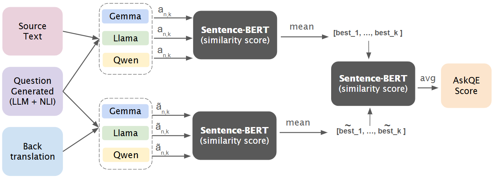

## Abstract

<p align="center">
  
</p>

_Figure: Overview of the proposed pipeline_

## Repo Structure
The repository is organized as:
```
DNLP-askQE/
    ├── Answers/                           # Model-generated answers for each dataset
        └── results_gemma_biomqm.jsonl
        └── results_gemma_contra.jsonl
        └── results_llama3_biomqm.jsonl
        └── results_llama3_contra.jsonl
        └── results_qwen_biomqm.jsonl
        └── results_qwen_contra.jsonl
    ├── Plot/                              # plot obtained
        └── biomqm_askqe_by_perturbation.png
        └── confidence_bt_biomqm.png
        └── confidence_bt_contra.png
        └── contra_askqe_by_perturbation.png
    ├── AskQE_finalVersion.ipynb           # script
    ├── readme.md
```

## Get ready
**Prerequisites**
- gpu to run the 3 models that we will use
- Hugging face account to use:
    - `meta-llama/Llama-3.1-8B-Instruct`
    - `Qwen/Qwen2.5-7B-Instruct`
    - `google/gemma-2-9b-it`
- Principal lybaries:
  - `torch`, `transformers`, `accelerate`, `bitsandbytes`
  - `sentence-transformers`
  - `pandas`, `numpy`, `scikit-learn`, `scipy`, `tqdm`, `matplotlib`, `seaborn`.

**Setup libraries**
```
!pip install -q bitsandbytes accelerate peft sentence-transformers jsonlines datasets einops
```

**Option 1 - Full pipeline**
- **Section 1 – Environment Setup & Data Loading**: Set up the environment (Colab/Drive), clone the AskQE repository, and load/serialize ContraTICO and BioMQM in .pkl format.

- **Section 2 – Question Answering for Each Model**: Define the prompt, the ModelEngine class, and the inference loop to make different LLMs answer all questions (both source and back‑translation).

- **Section 3 – Extension 1: LLM Ensemble**: Combine the responses of multiple LLMs and, for each question, select the most semantically consistent “centroid” answer. Finally, compute the AskQE score by comparing source and back‑translation responses using SBERT and identify potential hallucinations.

- **Section 4 – Results**: Analysis of ContraTICO and BioMQM.

- **Section 5 – Plots**: Three visualizations: (a) back‑translation confidence boxplot per model, (b) AskQE score boxplot per perturbation_type and model, (c) rate of possible hallucination.

- **Section 6 – Extension 2**: Error Categorization: The LLM‑as‑a‑Judge (Qwen2.5) classifies translation errors by choosing among nine categories (omission, expansion_noimpact, expansion_impact, intensifier, spelling, synonym, word_order, alteration, Unknown) by analyzing the source, back‑translation, and QA discrepancies. Compare predicted vs true labels.

**Option 2 - Only reproduce statistics**
- Use the provided answer files in `Answers/`
- Run the sections 3, 4, 5 and 6 to run the results and the two extensions

This second option avoids running heavy GPU computations, and is recommended if you are mainly interested in the analysis part of the project.


## Team
- Andrea Cauda s343386 - s343386@studenti.polito.it
- Roberto Cozzone s336155 - s336155@studenti.polito.it
- Pietro Giancristofaro s341870 - s341870@studenti.polito.it
- Davide Tonetti s334297 - s334297@studenti.polito.it
- Antonio Visciglia s346837 - s346837@studenti.polito.it
<hr style="height: 3px; border: 0; background-color: #808080; margin-top: 40px;">

**Research Paper:** This implementation is described in detail in:\
_"ASKQE: Question Answering as Automatic Evaluation for Machine Translation"_\
Cauda A., Cozzone R., Giancristofaro P., Tonetti D., Visciglia A. (2025)